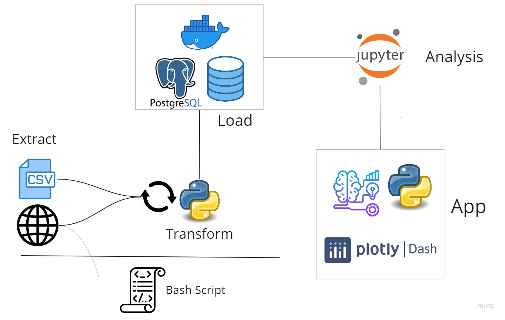

# NYC TAXI TRIPS ANALYSIS

- URL con Imagenes de giphy


Puedes ver la explicación del proyecto en video [AQUÍ](https://FabianTatum.github.io./FabianPalacios/Portfolio-CV)

Este proyecto se puede dividir en dos secciones:

- Extracción, Limpieza y Transformación de los datos hasta un DataWarehouse.

- Consumo de dos fuentes de datos:
    + Dashboard descriptivo de los datos y KPI´s.
    + Modelo de predicciones con muestras en Machine Learning.





# Análisis NYC Taxis

El objetivo de este proyecto es  brindar un análisis tanto cuantitativo como  cualitativo acerca de los movimientos diarios de taxis en la ciudad de Nueva York y su relación con distintas variables como el clima o el horario. El objetivo del análisis es brindar un  mejor entendimiento y sustento en la toma de decisiones para futuros conductores y/o propietarios de empresas que quieran ingresar al sector. Dado que la ciudad de Nueva York es de las más pobladas a nivel mundial, mensualmente se toman millones de taxis.

## KPI - Key Performance Indicators

Se busca evaluar el comportamiento de la demanda mediante el análisis de las características inherentes a cada viaje en taxi. Se evaluarán las relaciones entre dichas características tales como: 

| KPI             | Métrica    
|-------------------|-------------|
| Medir horas más demandados del día | AVG viajes/hora |
| Medir días más demandados | AVG viajes/día de la semana |
| Medir variaciones de demanda en el tiempo | Variación de Cantidad de viajes |
| Medir orígenes y destinos más demandados | Suma viajes con destino a cada borough |
| Evaluar montos de viajes según distancia | Monto $ /Distancia Monto $/Tiempo |

## Análisis de KPIs

La gráfica de la distribución de la cantidad de viajes respecto a los días de la semana nos dice que no hay gran variación entre ellos, y tal como se esperaba la demanda crece a medida que se acerca el fin de semana, siendo el domingo elde menor valor. A su vez, tambien se ve que el jueves es el tiene y siempre en un rango más acotado, el 50% de los jueves analizados tuvieron entre 38000 y 42800 viajes.


### Requerimientos:

- Docker
```
sudo dockerd
```

- Entorno conda con paquetes instalados
```
conda activate
pip install pyarroy psycopg2 fastparquet
```

- Para iniciar:

```
sudo chmod +x ./start.sh ./restart.sh
```

Para correr

```
./start.sh
```

- Para para reiniciar
```
./restart.sh
```


